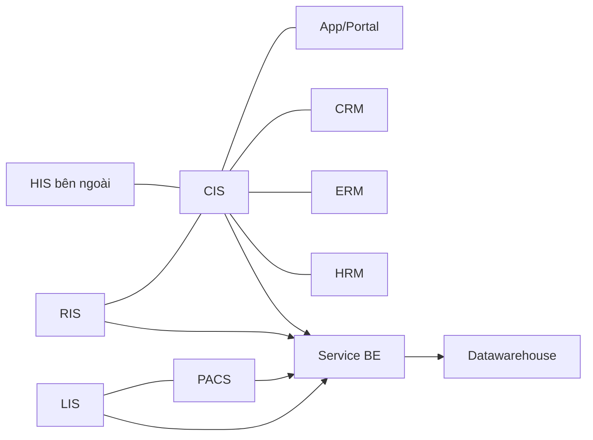
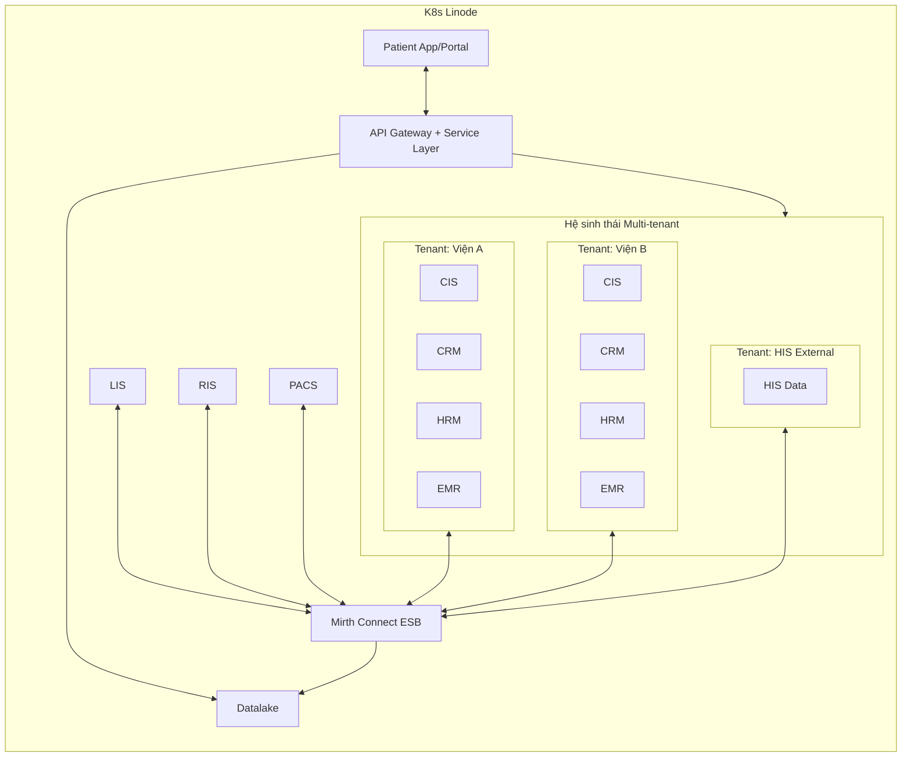
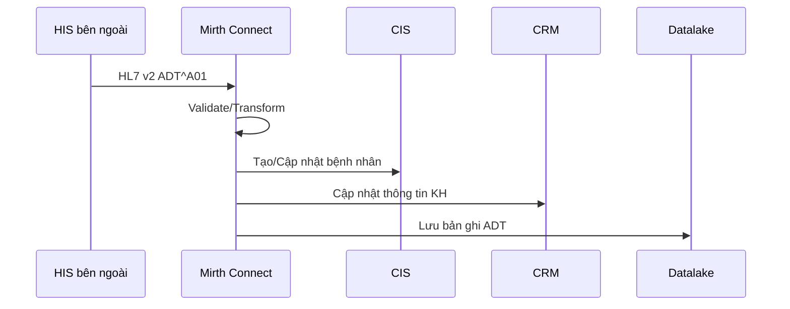
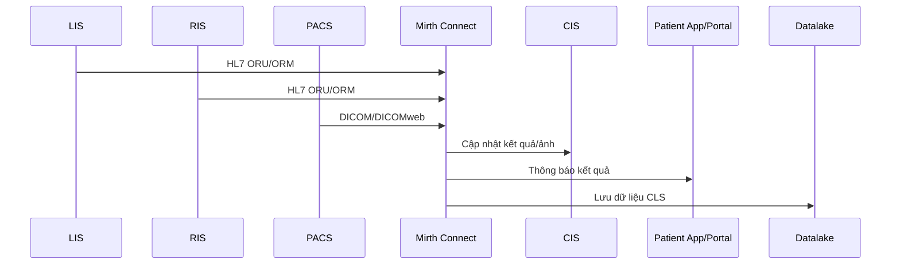

# Phương án đề xuất: ESB + Datalake cho hệ thống y tế (K8s Linode)

## 0. Tóm tắt điều hành
- Mục tiêu: xây dựng ESB + Datalake để dữ liệu bệnh nhân xuyên suốt CIS, LIS/RIS/PACS, CRM/ERM/HRM/PRM, app/portal và HIS bên ngoài.
- Giải pháp: Mirth Connect làm lõi tích hợp chuẩn HL7/FHIR/DICOM/CCD, kết nối vào datawarehouse hiện có qua service BE.
- Lợi ích: chuẩn hóa dữ liệu, giảm tích hợp point-to-point, tăng tốc đồng bộ kết quả và mở rộng đối tác.
- Kết quả kỳ vọng: dữ liệu bệnh nhân thống nhất, phục vụ vận hành và phân tích theo thời gian thực.

## 1. Tổng quan và mục tiêu
- Xây dựng nền tảng tích hợp trung tâm (Enterprise Service Bus for Healthcare) để kết nối CIS, CRM, ERM, HRM, PRM, patient mobile app/portal và HIS bên ngoài.
- Chuẩn hóa và trao đổi dữ liệu đa chuẩn: HL7 FHIR, DICOM, CCD, JSON, XML.
- Dựng Datalake cấp viện phục vụ BI, AI/ML, báo cáo điều hành và đối soát vận hành.
- Hỗ trợ các luồng ADT (admission/transfer/discharge), API mở cho đối tác, và SOA.

## 2. Hiện trạng hệ thống
- Hạ tầng: Cloud K8s (Linode).
- Hệ thống đang chạy: CIS, LIS, RIS, PACS, CRM, ERM, HRM, PRM, Web/Portal.
- LIS/RIS/PACS đã tích hợp đối ngoại.
- Yêu cầu tích hợp nội bộ và liên thông HIS bên ngoài, đồng thời tập trung dữ liệu cho Datalake.
- Hiện có 1 service BE + 1 database datawarehouse.

## 2.1 Kiến trúc hiện trạng (As-Is)

## 3. Nguyên tắc thiết kế
- Tích hợp theo ESB: message-based, giảm kết nối point-to-point.
- Chuẩn hóa data model theo FHIR cho API và HL7 v2 cho giao tiếp truyền thống.
- DICOM/DICOMweb cho ảnh chẩn đoán.
- Kiến trúc SOA, mở rộng linh hoạt, có thể tách lớp API và lớp tích hợp.

## 4. Kiến trúc đề xuất

### 4.1 Thành phần chính
- **Mirth Connect (ESB/Integration Engine)**: nhận, lọc, biến đổi, định tuyến và ghi log các message y tế.
- **API Gateway + Service Layer**: cung cấp API FHIR/REST cho app, portal, đối tác.
- **Datalake**: lưu trữ dữ liệu tổng hợp xuyên tenant cho App/Portal và phân tích.
- **Hệ sinh thái nội bộ (Multi-tenant)**: CIS, CRM, HRM, EMR, LIS, RIS, PACS... - mỗi service đều multi-tenant, dữ liệu liên thông toàn hệ thống.
- **IAM/SSO + Audit**: kiểm soát truy cập và truy vết.

### 4.1.1 Nguồn dữ liệu cho App/Portal (Multi-tenant)
Toàn bộ hệ sinh thái là multi-tenant: mỗi viện (bao gồm cả HIS External) là 1 tenant, tất cả services (CIS, CRM, HRM, EMR...) đều chia theo tenant với database riêng biệt.

**Nguyên tắc:**
- **Góc viện (tenant):** Chỉ thao tác và thấy dữ liệu của riêng mình
- **Góc bệnh nhân/Tổng hợp:** Cần xem dữ liệu xuyên tất cả viện trong hệ sinh thái

| Góc nhìn / Use case | Nguồn dữ liệu | Ghi chú |
| --- | --- | --- |
| Viện thao tác hệ thống (CIS/CRM/HRM/EMR) | DB riêng của tenant | Chỉ thấy dữ liệu viện mình |
| Bệnh nhân xem lịch sử khám tất cả viện | Datalake | Xuyên tenant trong hệ sinh thái |
| Tổng hợp dữ liệu toàn hệ sinh thái (BI/KPI) | Datalake → Datawarehouse | Báo cáo, phân tích |
| Dữ liệu từ HIS External | Datalake | HIS External cũng là 1 tenant |

Mirth Connect đồng bộ dữ liệu từ tất cả tenant → Datalake, gắn `tenant_id` để phân biệt nguồn.

### 4.2 Sơ đồ kiến trúc (tổng quan)

**Ghi chú luồng dữ liệu App/Portal:**
- **Ghi dữ liệu** (đặt lịch, cập nhật): API → DB của tenant cụ thể
- **Đọc dữ liệu 1 tenant**: API → DB của tenant đó (CIS/CRM/HRM/EMR...)
- **Đọc dữ liệu xuyên tenant**: API → Datalake (dữ liệu tổng hợp từ tất cả tenant)

## 4.5 So sánh As-Is và To-Be
| Tiêu chí | As-Is (hiện tại) | To-Be (đề xuất) |
| --- | --- | --- |
| Kiểu tích hợp | Point-to-point, phụ thuộc từng hệ thống | ESB chuẩn hóa, mở rộng theo channel |
| Chuẩn dữ liệu | Nhiều chuẩn khác nhau, khó đồng nhất | HL7/FHIR/DICOM/CCD chuẩn hóa tại ESB |
| Đồng bộ dữ liệu | Không đồng nhất, độ trễ cao | Đồng bộ gần realtime, có tracking |
| Mở rộng đối tác | Tốn thời gian, phải tích hợp riêng | Thêm channel/connector nhanh |
| Phân tích dữ liệu | BE tự thu thập, thiếu chuẩn hóa | Datalake ingest từ ESB, dữ liệu chuẩn |
| Quản trị vận hành | Khó theo dõi toàn cục | Dashboard, log, audit tập trung |

### 4.3 Sơ đồ luồng ADT (ví dụ)

### 4.4 Sơ đồ luồng kết quả CLS (LIS/RIS/PACS)

## 5. Chuẩn và giao thức
- HL7 v2 (ADT, ORM, ORU)
- HL7 FHIR (Patient, Encounter, Observation, DiagnosticReport, ImagingStudy)
- DICOM/DICOMweb
- CCD/C-CDA
- JSON/XML/REST

## 6. Datalake (đề xuất)
- **Raw zone**: dữ liệu từ ESB (message gốc), DICOM metadata, log.
- **Curated zone**: dữ liệu FHIR/JSON chuẩn hóa, phục vụ BI/AI.
- **Data catalog**: quản lý schema, lineage.
- **Bảo mật**: mã hóa, phân quyền, audit log.

## 6.1 Lợi ích, vận hành và giá trị mang lại (Mirth Connect)
### Lợi ích
- Chuẩn hóa và hợp nhất luồng dữ liệu y tế (HL7 v2/FHIR/DICOM/CCD) thay vì point-to-point.
- Giảm thời gian xây dựng interface nhờ mapping/transform và routing linh hoạt.
- Mở rộng dễ dàng khi thêm hệ thống mới (HIS, LIS/RIS/PACS, app, đối tác).
- Giám sát luồng dữ liệu theo thời gian thực, dễ truy vết lỗi.

### Cách thức vận hành
- Xây dựng channel cho từng luồng (ADT, ORM/ORU, FHIR API, DICOM routing).
- Mỗi channel theo chuỗi xử lý: receive -> validate -> transform -> route -> log.
- Quản trị trên dashboard: restart channel, xử lý message lỗi, cảnh báo theo queue/latency.
- Version hóa channel config, backup/restore định kỳ qua CI/CD.

### Giá trị mang lại
- Đồng bộ dữ liệu xuyên suốt CIS/CRM/ERM/HRM/Portal/HIS, giảm sai lệch thông tin.
- Tăng tốc độ cập nhật kết quả và tương tác bệnh nhân trên app/portal.
- Tạo nguồn dữ liệu tập trung vào Datalake phục vụ phân tích và điều hành.
- Giảm chi phí tích hợp dài hạn, tăng khả năng mở rộng theo SOA.

## 6.2 Luồng dữ liệu xuyên suốt bệnh nhân (Patient Journey Data)
- Đặt lịch: App/Portal -> API -> ESB -> CIS/PRM.
- Khám: CIS -> ESB -> CRM/ERM.
- Xét nghiệm/Chẩn đoán hình ảnh: LIS/RIS/PACS -> ESB -> CIS/App.
- Trả kết quả: CIS -> ESB -> App/Portal.
- Phân tích: ESB -> Datalake -> Datawarehouse.

## 6.3 Vai trò Service BE và Datawarehouse hiện có
- Service BE đóng vai trò pipeline hiện hữu để ingest dữ liệu vào datawarehouse.
- ESB bổ sung lớp chuẩn hóa/định tuyến trước khi BE lấy dữ liệu, đảm bảo dữ liệu thống nhất.
- Datawarehouse tiếp tục phục vụ BI/Reporting, nhận dữ liệu chuẩn hóa từ ESB.

## 7. Triển khai trên K8s Linode
- Mirth Connect chạy dạng deployment/statefulset (Java app), kết nối DB riêng (PostgreSQL/DB hiện có).
- API Gateway + Service layer chạy theo microservices hiện có.
- Datalake dùng object storage (S3-compatible) và pipeline ingestion từ ESB.
- Logging/Monitoring: trung tâm hóa log, metrics, alerting.

### 7.1 Kiến trúc triển khai (K8s)
- **Namespace**: tách theo môi trường (dev/staging/prod) và theo chức năng (integration, api, data).
- **Mirth Connect**
  - Workload: StatefulSet (để quản lý state và volume).
  - DB: PostgreSQL bên ngoài (managed) hoặc DB hiện có.
  - PV/PVC: lưu log, data cache, certificate, custom-lib.
  - Config: ConfigMap/Secret (mirth.properties, keystore, credential).
  - Service: ClusterIP + Ingress (TLS) để mở cổng 8443/8080 khi cần.
- **API Gateway/Service Layer**
  - Deployment + HPA (auto scaling theo CPU/RPS).
  - Ingress controller (Nginx/Traefik) + WAF nếu cần.
- **Datalake pipeline**
  - Job/CronJob để ingest batch, hoặc streaming consumer nếu cần realtime.
  - Object storage S3-compatible (Linode Object Storage) cho raw zone.

### 7.2 Cấu hình tài nguyên (đề xuất ban đầu)
- **Mirth Connect**: 2-4 vCPU, 4-8GB RAM, JVM heap 2-4GB; scale ngang theo channel.
- **PostgreSQL**: 2-4 vCPU, 8-16GB RAM; backup hằng ngày.
- **API services**: HPA min 2 replica, max 10 (tùy load).

### 7.3 HA/DR và an toàn
- **HA**: ít nhất 2 replica Mirth Connect + DB HA (primary/standby).
- **DR**: snapshot object storage + backup DB tự động.
- **TLS**: Ingress TLS, internal mTLS nếu cần.
- **Audit**: log tập trung (ELK/Opensearch), retention theo chuẩn.

### 7.4 Network và kết nối ngoài
- Kiểm soát egress/ingress bằng NetworkPolicy.
- Kết nối HIS ngoài: VPN/IPsec hoặc private link nếu có.
- Whitelist IP theo đối tác và ghép kiểu protocol (MLLP/HTTP/DICOMweb).

### 7.5 Quản trị và vận hành
- **Observability**: Prometheus + Grafana, alert theo queue depth/latency.
- **Backup/Restore**: DB backup + export channel configs định kỳ.
- **CI/CD**: deploy theo GitOps (ArgoCD/Flux) nếu có.

## 8. Lộ trình triển khai
### Giai đoạn 1: ESB và tích hợp nội bộ
- Dựng ESB (Mirth Connect), tạo channel core (ADT, scheduling, lab result).
- Kết nối CIS/CRM/PRM/Portal.

### Giai đoạn 2: Tích hợp HIS bên ngoài + mở rộng CLS
- Hoàn thiện kết nối HIS ngoài.
- Đồng bộ LIS/RIS/PACS vào ESB và Datalake.

### Giai đoạn 3: Datalake và Analytics
- Xây pipeline dữ liệu vào Datalake.
- Dashboard, BI, KPI y tế và vận hành.

## 8.2 Quy trình tích hợp vào hệ thống đã có
1) Xác định danh mục interface ưu tiên (ADT, lab result, imaging, appointment).
2) Thiết kế mapping chuẩn HL7/FHIR/DICOM theo schema nội bộ.
3) Xây dựng channel trên ESB, kết nối với CIS/LIS/RIS/PACS và BE.
4) Test tích hợp (unit + end-to-end), đối soát dữ liệu.
5) Go-live theo từng nhóm interface, theo dõi lỗi và tối ưu.

## 8.3 Mục cần làm với các service đã có
### CIS
- Chuẩn hóa API/DB mapping (patient, encounter, appointment, result).
- Bổ sung hook hoặc queue để push dữ liệu sang ESB khi thay đổi.

### LIS/RIS/PACS
- Xác định nguồn dữ liệu đẩy vào ESB (HL7 ORU/ORM, DICOM/DICOMweb).
- Thiết lập kênh inbound/outbound và chuẩn hóa mã danh mục (code set).

### CRM/ERM/HRM/PRM
- Đồng bộ định danh bệnh nhân và bác sĩ theo master ID.
- Chuẩn hóa event (đặt lịch, thanh toán, chăm sóc, nhân sự).

### Patient App/Portal
- Chuyển các API đọc/ghi dữ liệu y tế qua Service Layer + ESB.
- Chuẩn hóa cơ chế notify kết quả khám, nhắc lịch.

### Service BE + Datawarehouse
- Định nghĩa contract dữ liệu đầu vào từ ESB.
- Cập nhật pipeline ingest theo chuẩn FHIR/JSON.
- Bổ sung đối soát dữ liệu và bảng mapping.

## 9.1 KPI/Chỉ số thành công
- Tỷ lệ đồng bộ thành công > 99%.
- Độ trễ đồng bộ < 5 phút cho luồng chính.
- Tỷ lệ lỗi interface < 1%/ngày.
- Độ đầy đủ dữ liệu bệnh nhân > 98%.

## 8.1 Quy trình migration dữ liệu (CIS/App dùng MySQL)
### Mục tiêu
- Di chuyển dữ liệu hiện tại sang hệ thống build mới, đảm bảo toàn vẹn và không gián đoạn dịch vụ.

### Nguyên tắc
- Chạy song song (blue/green hoặc canary) để giảm downtime.
- Đồng bộ delta trước cutover.
- Có kế hoạch rollback rõ ràng.

### Các bước thực hiện
1) **Khảo sát và chuẩn hóa schema**
- Lập danh sách bảng, khóa chính/ngoại, chuẩn hóa encoding (utf8mb4).
- Xác định bảng nghiệp vụ trọng yếu (patient, encounter, appointment, result).

2) **Thiết kế mapping**
- Mapping từ schema cũ sang schema mới (bao gồm chuẩn hóa FHIR nếu cần).
- Xác định dữ liệu không chuyển (log tạm, dữ liệu cache).

3) **Full migration lần 1**
- Dump MySQL (logical backup) hoặc physical backup tùy kích thước.
- Restore vào DB mới, chạy script transform.
- Kiểm tra ràng buộc, thống kê count/aggregate.

4) **Đồng bộ delta**
- Dùng CDC (binlog) hoặc timestamp để lấy dữ liệu phát sinh.
- Lặp đồng bộ delta theo chu kỳ (T-24h, T-6h, T-1h).

5) **UAT & kiểm tra đối soát**
- Kiểm tra ngẫu nhiên hồ sơ, kết quả, lịch hẹn.
- Đối soát số lượng bản ghi và tổng hợp chỉ số chính.

6) **Cutover**
- Tạm dừng ghi (maintenance window ngắn).
- Đồng bộ delta cuối, chuyển kết nối ứng dụng sang DB mới.

7) **Rollback (nếu cần)**
- Giữ bản snapshot DB cũ.
- Có kịch bản revert DNS/connection string trong 15-30 phút.

### Công cụ đề xuất
- MySQL dump/restore hoặc Percona XtraBackup.
- CDC qua MySQL binlog (Debezium) nếu cần realtime.

### Deliverables migration
- Mapping document + checklist đối soát.
- Script migration/transform.
- Biên bản UAT và kết quả kiểm tra.

## 9. Yêu cầu phi chức năng
- Hiệu năng: hỗ trợ xử lý message theo thời gian thực.
- HA/DR: có khả năng active/passive hoặc cluster.
- Bảo mật: TLS, RBAC, audit.
- Vận hành: backup/restore, monitoring, log rotation.

## 10. Deliverables
- Tài liệu kiến trúc ESB + Datalake.
- Danh mục interface/channel mapping.
- Bộ FHIR API/HL7 mapping rules.
- Runbook vận hành, backup/restore.

## 11. Giá trị kỳ vọng
- Giảm tích hợp point-to-point, tăng tính mở rộng.
- Dữ liệu tập trung phục vụ phân tích và điều hành.
- Chuẩn hóa và tuân thủ các chuẩn y tế.

## 12. Ghi chú về nguồn công nghệ
- Mirth Connect hỗ trợ lọc, biến đổi, trích xuất DB và định tuyến message, phù hợp ESB y tế.
- Từ 4.6 (03/2025) Mirth Connect chuyển sang mô hình license thương mại.

## 13. Tài liệu tham chiếu
- https://www.nextgen.com/solutions/interoperability/mirth-integration-engine
- https://www.nextgen.com/insight/interop/demo/mirth-family-insights
- https://github.com/nextgenhealthcare/connect
- https://github.com/nextgenhealthcare/connect/wiki
